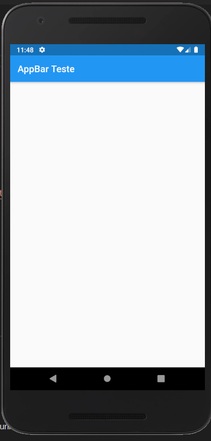

# AppBar

Exemplo de AppBar.


<div align="center">
  
</div>
</br>

------------

#### Comandos Flutter
###### Executar Aplicação
```shell
    flutter run
```

---

<h4 align="center"> <em></></em> by <a href="https://github.com/Francisco1030" target="_blank"> Francisco Viana</a> </h4>